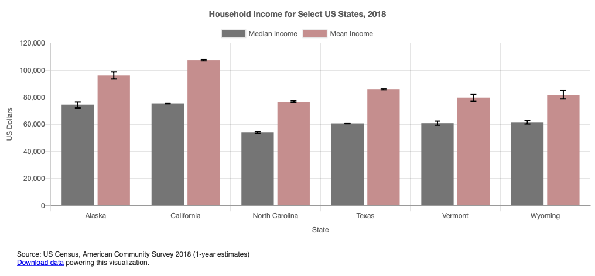
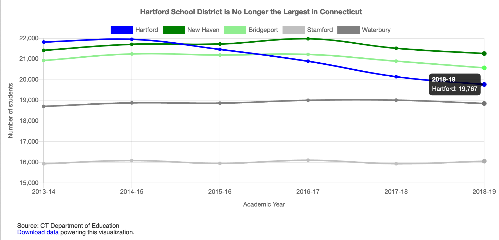

# Chart.js Templates by handsondataviz.org

## Bar Chart with 1+ Series

Demo: https://handsondataviz.github.io/chartjs-templates/bar-chart/index.html

Code and instructions: https://github.com/handsondataviz/chartjs-templates/tree/master/bar-chart

See **Bar Chart with CSV Data** chapter in handsondataviz: https://handsondataviz.org/bar-chart-with-csv-data.html

## Bar Chart with 1+ Series (with error bars)

Demo: https://handsondataviz.github.io/chartjs-templates/bar-chart-with-error-bars/index.html

Code and instructions: https://github.com/handsondataviz/chartjs-templates/tree/master/bar-chart-with-error-bars

## Line Chart with 1+ Series

Demo: https://handsondataviz.github.io/chartjs-templates/line-chart/index.html

Code and instructions: https://github.com/handsondataviz/chartjs-templates/tree/master/line-chart

See **Line Chart with CSV Data** chapter in handsondataviz: https://handsondataviz.org/line-chart-with-csv-data.html

## Scatter Chart with One Series

Demo: https://handsondataviz.github.io/chartjs-templates/scatter-chart/index.html

Code and instructions: https://github.com/handsondataviz/chartjs-templates/tree/master/scatter-chart

See **Scatter Chart with CSV Data** chapter in handsondataviz: https://handsondataviz.org/scatter-chart-with-csv-data.html

## Bubble Chart with One Series

Demo: https://handsondataviz.github.io/chartjs-templates/bubble-chart/index.html

Code and instructions: https://github.com/handsondataviz/chartjs-templates/tree/master/bubble-chart

See **Bubble Chart with CSV Data** chapter in handsondataviz: https://handsondataviz.org/bubble-chart-with-csv-data.html